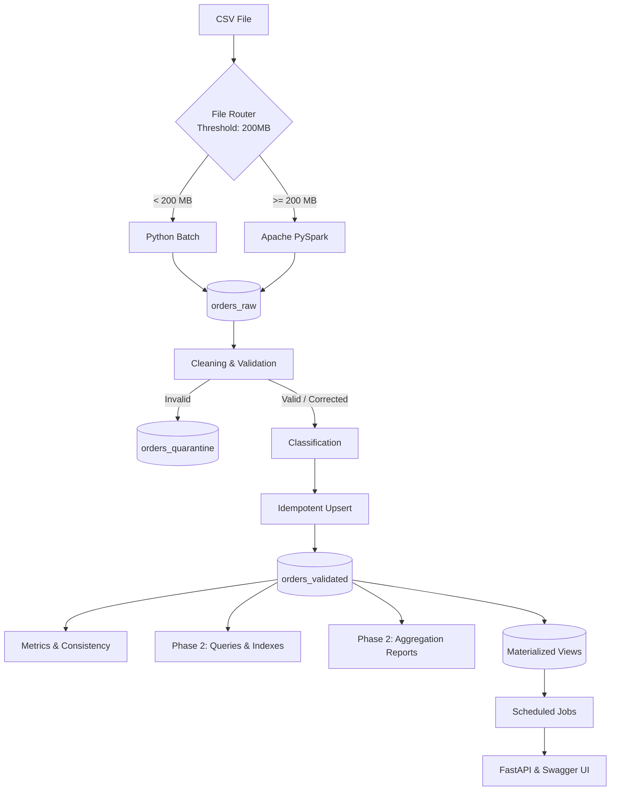

<div align="center">
  <h1>Midterm Data Pipeline - Hybrid ELT System</h1>
  <p><strong>المشروع النصفي والنهائي — مقرر البيانات الضخمة (Big Data)</strong></p>
</div>

<br>

**بيانات الطالب:**
- **الاسم:** محمد يوسف حمود سعيد الربيعي
- **الجامعة:** جامعة الرازي (Al-Razi University)
- **المستوى:** AI Level 4
- **رابط المشروع (GitHub):** [mohammedalrubai/midterm-data-pipeline](https://github.com/mohammedalrubai/midterm-data-pipeline)

---

## 📑 جدول المحتويات (Table of Contents)
1. [مقدمة (Introduction)](#-مقدمة-introduction)
2. [دورة حياة البيانات (End-to-End Flow)](#-دورة-حياة-البيانات-end-to-end-flow)
3. [المرحلة الأولى (Phase 1: Data Pipeline & ELT)](#-المرحلة-الأولى-phase-1-data-pipeline--elt)
4. [المرحلة الثانية (Phase 2: Analytics & API Layer)](#-المرحلة-الثانية-phase-2-analytics--api-layer)
5. [مجموعات قاعدة البيانات (MongoDB Collections)](#-مجموعات-قاعدة-البيانات-mongodb-collections)
6. [مخرجات المشروع (Deliverables)](#-مخرجات-المشروع-deliverables)
7. [التقنيات المستخدمة (Technologies Used)](#-التقنيات-المستخدمة-technologies-used)
8. [التثبيت والإعداد (Installation & Setup)](#-التثبيت-والإعداد-installation--setup)
9. [طريقة التشغيل (Running the Project)](#-طريقة-التشغيل-running-the-project)
10. [الاختبارات (Testing)](#-الاختبارات-testing)

---

## 📌 مقدمة (Introduction)

هذا المشروع عبارة عن نظام متكامل لمعالجة وتحليل البيانات الضخمة (Hybrid ELT Data Pipeline) مخصص لمعالجة ملفات طلبات متجر إلكتروني. يعتمد النظام على معمارية ELT حيث يتم استخراج البيانات وتحميلها إلى طبقة خام (Raw Layer) أولاً، ومن ثم يتم إجراء عمليات التنظيف، التحقق، التحليل، وجدولة المهام من داخل قاعدة البيانات.

المشروع مبني ليكون قابلاً للتوسع (Scalable) من خلال توجيه الملفات ديناميكيًا حسب حجمها (File Router)، بالإضافة إلى توفير واجهة برمجية موحدة (FastAPI) لتنفيذ وإدارة كافة المهام.

---

## 🔄 دورة حياة البيانات (End-to-End Flow)

تتبع البيانات في هذا النظام المسار التالي من لحظة قراءتها وحتى تصديرها كتقارير:



---

## ⚙️ المرحلة الأولى (Phase 1: Data Pipeline & ELT)

تُعنى المرحلة الأولى باستلام البيانات الخام ومعالجتها لضمان جودتها قبل تخزينها النهائي.

### 1. File Router
يحتوي النظام على موجه تلقائي للملفات بناءً على حجمها:
- **Python Batch Processing**: للملفات التي يقل حجمها عن `200 MB`.
- **Apache PySpark**: للملفات الضخمة (أكبر من أو يساوي `200 MB`).

### 2. Raw Data Layer (`orders_raw`)
تطبيقاً لمبدأ **ELT**، يتم تحميل البيانات مباشرة كما هي من ملف CSV إلى مجموعة `orders_raw`.
هذا يحفظ الـ **Data Lineage** لضمان التتبع، حيث يحتوي كل سجل على:
- `run_id`: معرف عملية التشغيل.
- `source_file`: اسم الملف المصدر.
- `source_row_number`: رقم السطر الأصلي.
- `ingested_at`: وقت التحميل.
- `engine_used`: المحرك المستخدم (Python أو Spark).
- `raw_record`: البيانات الخام بالكامل.

### 3. Data Cleaning & Validation
يتم تنظيف وتصحيح البيانات عبر مجموعة من القواعد (Rules) المبرمجة:
1. **Arabic digits normalization**: تحويل الأرقام العربية إلى إنجليزية.
2. **Currency normalization**: توحيد العملات وإزالة الرموز.
3. **Thousand separators normalization**: إزالة فواصل الآلاف.
4. **Word prices normalization**: تحويل الأسعار المكتوبة نصياً (مثل "ألف") إلى أرقام.
5. **Phone formatting**: تنظيف أرقام الهواتف وتوحيد صيغتها.
6. **Email repair**: إصلاح أخطاء البريد الإلكتروني الشائعة.
7. **Date normalization**: توحيد صيغ التواريخ.
8. **Order status normalization**: تصحيح حالات الطلب وإزالة المسافات.
9. **Total recomputation**: إعادة حساب الإجمالي وتصحيحه إذا كان خاطئاً.

يتم تصنيف السجلات الناتجة إلى:
- `VALID`: بيانات صحيحة من البداية.
- `CORRECTED`: بيانات تم تصحيحها (مع الاحتفاظ بـ **Audit Trail** للتصحيحات).
- `QUARANTINE`: بيانات غير قابلة للإصلاح.

### 4. Quarantine (`orders_quarantine`)
السجلات التالفة جداً والتي تفتقد لمعلومات حيوية تُنقل إلى العزل، مع تحديد **Error Code**.
الأخطاء المعرفة في النظام تشمل:
- `MISSING_ORDER_ID`
- `MISSING_CUSTOMER_ID`
- `DUPLICATE_ORDER_ID`
- `INVALID_IMPOSSIBLE_DATE`
- `CORRUPTED_ITEMS_JSON`
- `EMPTY_ITEMS`
- `UNKNOWN_PRICE`
- `AMBIGUOUS_NEGATIVE_VALUE`
- `MULTIPLE_CONFLICTING_ERRORS`

### 5. Idempotent Upsert
لمنع تكرار البيانات، يتم إدراج السجلات في `orders_validated` باستخدام `order_id` كمعرف فريد:
- **First Run**: يتم إدراج البيانات كـ `Insert`.
- **Repeated Run**: يتم تحديث البيانات أو تجاهلها `Update / Unchanged` (يمنع التكرار).

### 6. Metrics & Consistency
يتم تصدير إحصائيات التشغيل في ملف `reports/results.json`.
تتضمن الإحصائيات:
- `run_id`, `file_name`, `file_size_mb`, `engine_used`
- `rows_read`, `raw_loaded`, `elapsed_seconds`, `throughput`
- `valid_count`, `corrected_count`, `quarantine_count`
- `inserted_count`, `updated_count`, `unchanged_count`
- `error_case_counts` (تفصيل الأخطاء).

**معادلة الاتساق (Consistency Check) التي يحققها النظام:**
`raw_loaded = valid_count + corrected_count + quarantine_count`

---

## 📈 المرحلة الثانية (Phase 2: Analytics & API Layer)

بناء طبقة التحليلات والتقارير وواجهة برمجة التطبيقات للمشروع.

### 1. Queries / Indexes / Explain
لتحسين أداء قراءة البيانات، تم إعداد:
- **5 استعلامات (Queries):** (`orders_in_city`, `orders_by_status`, `customer_total_spending`, `quarantine_by_error_code`, `city_status_compound`).
- **3 فهارس (Indexes):** تتضمن **Compound Index** لتحسين البحث المتعدد.
- **Explain Analysis:** تحليل الأداء قبل وبعد الفهارس لبيان الانخفاض الكبير في الـ `docs_examined` والوقت المستغرق.

### 2. Aggregation Reports
يحتوي النظام على 5 تقارير تجميعية:
1. `sales_by_city`: أعلى المدن مبيعاً.
2. `top_products`: المنتجات الأكثر مبيعاً وإيراداً.
3. `top_customers`: العملاء الأكثر إنفاقاً.
4. `sales_by_period`: المبيعات الزمنية (شهرياً).
5. `order_status_distribution`: توزيع ونسب حالات الطلبات.

### 3. Materialized Views
لتحسين استعلام التقارير الثقيلة، تم استخدام العروض المادية:
1. `daily_sales_summary`
2. `top_products_summary`

يدعم النظام **Incremental Refresh** (تحديث تزايدي) باستخدام مجموعة `mv_metadata`، بحيث يتم تحديث السجلات الجديدة فقط دون إعادة معالجة جميع البيانات القديمة.

### 4. Scheduled Jobs
تم إعداد مهام مجدولة للعمل في الخلفية:
1. `refresh_views`: لتحديث العروض المادية تلقائياً.
2. `daily_report`: لإنشاء تقرير يومي شامل وحفظ الإحصائيات.

يتم تسجيل حالة المهام ووقت التنفيذ والنتائج في مجموعة الـ `job_logs`.

### 5. FastAPI & Swagger UI
تم توحيد المشروع تحت واجهة برمجة تطبيقات واحدة تضم **10 Endpoints**:
- `GET /health`
- `POST /ingest`
- `POST /indexes`
- `GET /queries`
- `GET /queries/{name}`
- `GET /aggregations`
- `GET /aggregations/{name}`
- `POST /refresh-mv`
- `GET /jobs`
- `POST /jobs/{name}/run`

الواجهة موثقة بالكامل باستخدام **Swagger** عبر الرابط: `/docs`.

---

## 🗄️ مجموعات قاعدة البيانات (MongoDB Collections)

- **Phase 1:**
  - `orders_raw`: البيانات الخام غير المعدلة.
  - `orders_validated`: السجلات النظيفة والموثوقة.
  - `orders_quarantine`: السجلات الفاسدة والمعزولة.
- **Phase 2:**
  - `daily_sales_summary`: العرض المادي لمبيعات الأيام.
  - `top_products_summary`: العرض المادي لأفضل المنتجات.
  - `mv_metadata`: لتتبع أوقات آخر تحديث تزايدي.
  - `job_logs`: سجلات المهام المجدولة المكتملة أو الفاشلة.

---

## 🎯 مخرجات المشروع (Deliverables)

| المرحلة | المتطلب / الميزة | الحالة |
|---------|-----------------|--------|
| **Phase 1** | Hybrid ELT Architecture | ✅ منجز |
| | File Router (Python vs PySpark) | ✅ منجز |
| | MongoDB Raw Layer | ✅ منجز |
| | Data Cleaning & Validation Rules | ✅ منجز |
| | Quarantine with Error Codes | ✅ منجز |
| | Idempotent Upsert (No Duplicates) | ✅ منجز |
| | Metrics & Consistency Equation | ✅ منجز |
| **Phase 2** | 5 Queries | ✅ منجز |
| | 3 Indexes (incl. Compound Index) | ✅ منجز |
| | Explain Analysis (Before/After) | ✅ منجز |
| | 5 Aggregation Reports | ✅ منجز |
| | 2 Materialized Views | ✅ منجز |
| | Incremental Refresh | ✅ منجز |
| | 2 Scheduled Jobs with Logging | ✅ منجز |
| | FastAPI Integration (10 Endpoints) | ✅ منجز |
| | Swagger UI Documentation | ✅ منجز |

---

## 💻 التقنيات المستخدمة (Technologies Used)
- **Python** (اللغة الأساسية)
- **Apache PySpark** (لمعالجة البيانات الكبيرة)
- **MongoDB & PyMongo** (قاعدة البيانات الأساسية)
- **FastAPI** (بناء الواجهة البرمجية)
- **Uvicorn** (خادم الـ API)
- **Git / GitHub** (لإدارة النسخ)

---

## 🚀 التثبيت والإعداد (Installation & Setup)

**المتطلبات الأساسية:**
- Python 3.10+
- Java JDK 11+ (مطلوب لـ PySpark)
- MongoDB 6.0+ (يجب أن يعمل كخدمة محلية)
- نظام التشغيل Windows (تم استخدام PowerShell)

**الخطوات:**
1. استنساخ المستودع:
```powershell
git clone https://github.com/mohammedalrubai/midterm-data-pipeline.git
cd midterm-data-pipeline
```

2. إنشاء بيئة افتراضية وتفعيلها:
```powershell
py -m venv .venv
.venv\Scripts\Activate.ps1
```

3. تثبيت المكتبات المطلوبة:
```powershell
pip install -r requirements.txt
```

4. إعداد متغيرات البيئة:
- قم بنسخ ملف `.env.example` وإعادة تسميته إلى `.env`.

5. ضع ملف البيانات بصيغة `.csv` داخل مجلد `data/`.

---

## ▶️ طريقة التشغيل (Running the Project)

يجب التأكد أولاً من أن خادم **MongoDB** قيد التشغيل (على `localhost:27017`).

### تشغيل Phase 1 (Data Pipeline):
```powershell
# سيقوم الـ Router باختيار Python أو PySpark بناءً على الحجم تلقائياً
py src/main.py data/orders_small_sample.csv --reset
```

### تشغيل Phase 2 (التقارير والاستعلامات محلياً):
```powershell
# تشغيل الاستعلامات والفهارس
py src/queries.py

# تشغيل التجميعات
py src/aggregations.py

# تحديث العروض المادية
py src/materialized_views.py

# تشغيل المهام المجدولة
py src/scheduler.py
```

### تشغيل واجهة الـ API (الكل في واحد):
```powershell
py -m uvicorn src.api:app --reload
```
- بعد التشغيل، قم بزيارة: [http://localhost:8000/docs](http://localhost:8000/docs) لتجربة جميع خصائص المشروع من واجهة **Swagger**.

---

## 🧪 الاختبارات (Testing)

تم بناء **46 اختبار وحدة (Unit Tests)** فعلية باستخدام `pytest` لضمان عمل كافة القواعد بشكل مثالي وعدم كسر وظائف المرحلة الأولى.

لتشغيل الاختبارات:
```powershell
py -m pytest tests/ -v
```

يشمل الفحص:
- اختبار قواعد التنظيف (Cleaning Rules).
- اختبار تصنيف البيانات والتوجيه للـ Quarantine.
- اختبار التحقق من الشذوذ في المدخلات.

---
<div align="center">
  <b>تم بناء هذا المشروع ليكون مطابقاً لأعلى معايير هندسة البيانات ضمن مقرر البيانات الضخمة (Big Data).</b>
</div>
